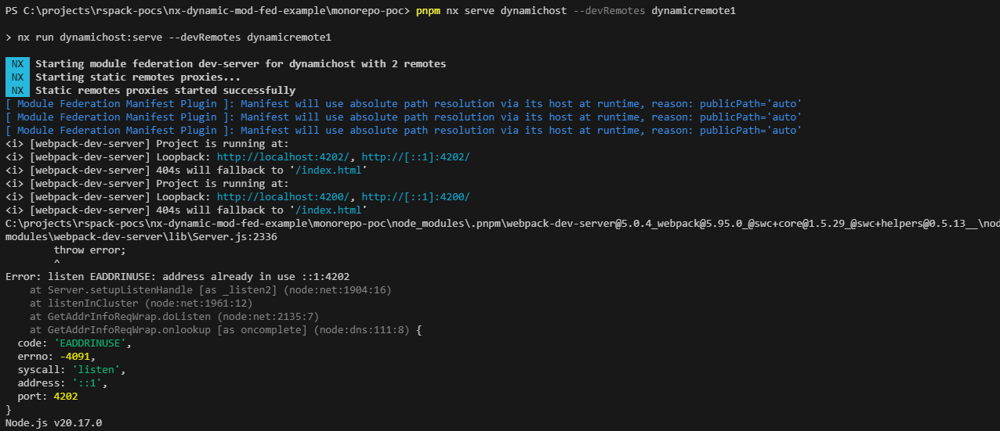
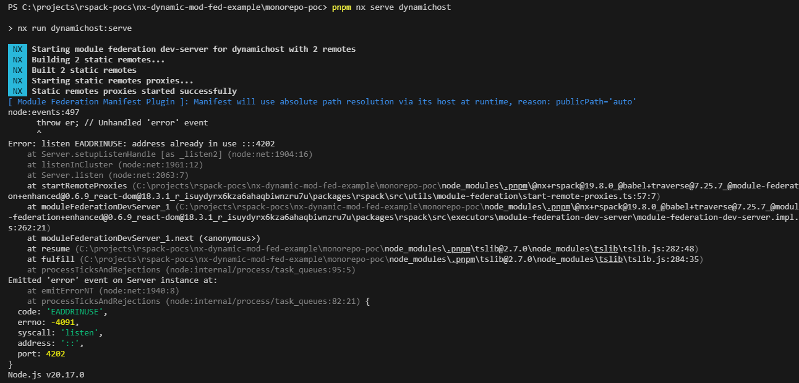

# Introduction

This repository uses NX 19.8.3 and contains:

- An integrated monorepo
- A dynamic module federation host app using React and RSPack
- A dynamic module federation remote app using React and RSPack

---

# Error

Currently when try and run these apps they return a port conflict error.

## Example 1

`pnpm nx serve dynamichost --devRemotes dynamicremote1`



## Example 2

`pnpm nx serve dynamichost`


---

# NX Report

```
Node           : 20.17.0
OS             : win32-x64
Native Target  : x86_64-windows
pnpm           : 9.12.0

nx                 : 19.8.3
@nx/js             : 19.8.3
@nx/jest           : 19.8.3
@nx/linter         : 19.8.3
@nx/eslint         : 19.8.3
@nx/workspace      : 19.8.3
@nx/cypress        : 19.8.3
@nx/devkit         : 19.8.3
@nx/eslint-plugin  : 19.8.3
@nx/react          : 19.8.3
@nrwl/tao          : 19.8.3
@nx/web            : 19.8.3
typescript         : 5.5.4
---------------------------------------
Registered Plugins:
@nx/eslint/plugin
@nx/cypress/plugin
@nx/jest/plugin
---------------------------------------
Community plugins:
@nx/rspack : 19.8.0
```
